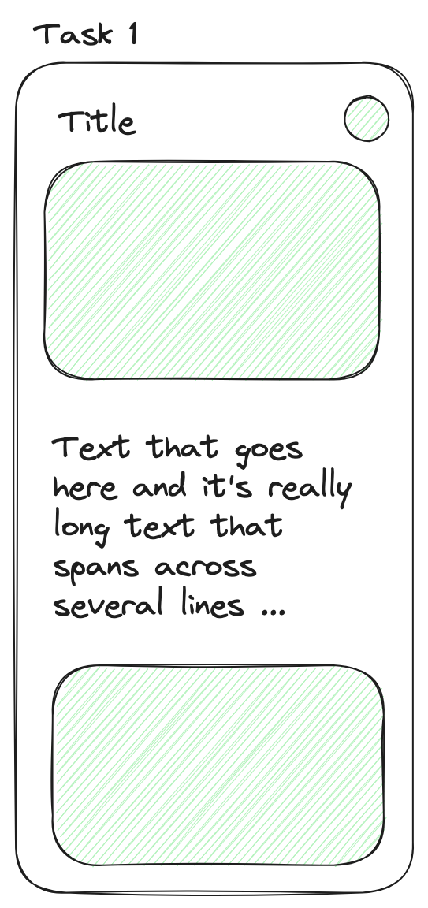
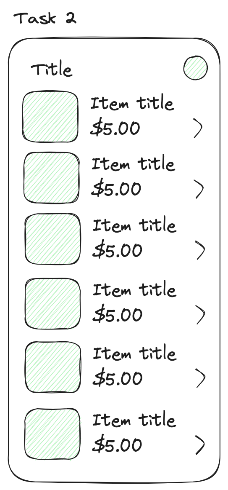
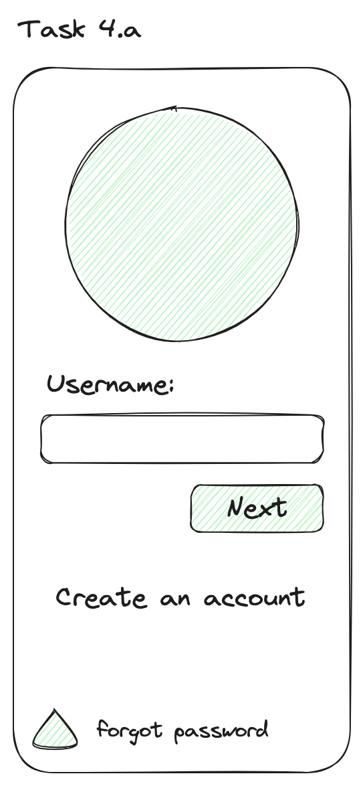
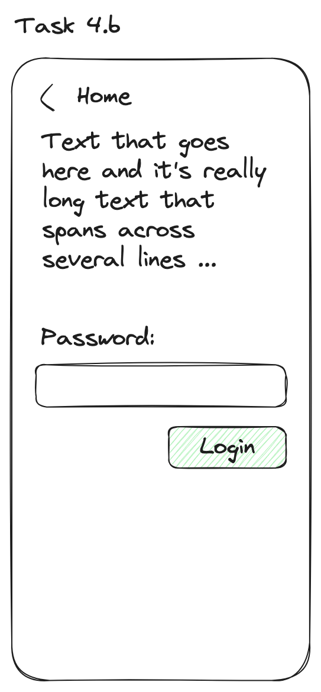

### Task 1: **Implement the followin layout**

### Task 2: **Implement the followin layout**

### Task 3: **Implement the followin layout**

### Task 4: **Implement the followin layout**

> Use `@State` to be able to "loop" between first layout and the next layout when clicking on the "Next/Login" button.

